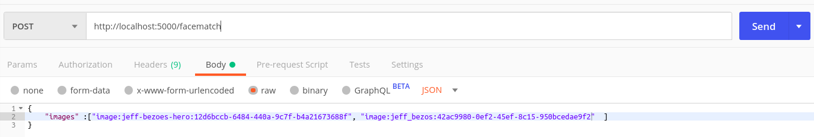
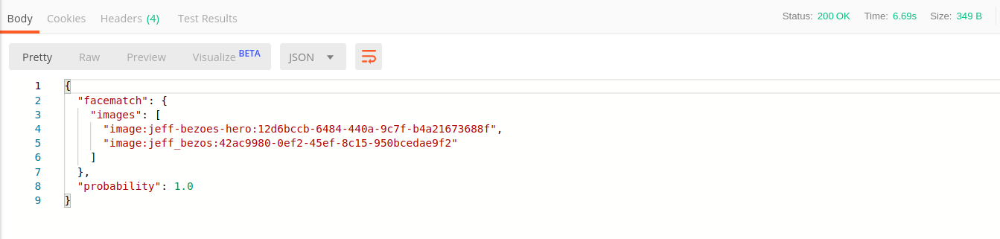

# Face Matching Service
- A face matching service which compares two images with a face in each for how similar they are.
- Given an input to the service with two images, it responds with a probability which is in essence a similarity score between the two on a range of 0 ... 1.0

# How to get the service running?
- Install [Docker Compose](https://docs.docker.com/compose/install/)
- Go to the file .env.docker and include credentials for AWS_ACCESS and AWS_SECRET, which are the aws_access_id and aws_secret_key to access the aws-rekognition API
- Use the following command to get the services running.

~~~
docker-compose up
~~~
# Services included
- Dockerized Redis database that hold binary images
- Dockerized Python3 Flask web application
- [HTTP Post endpoint](http://localhost:5000/facematch)

# APIs used
- AWS-Rekognition : CompareFaces compares a face from the source image to a face from the target image and responds with a similarity score.

# Demo
### Sample request

### Sample response
